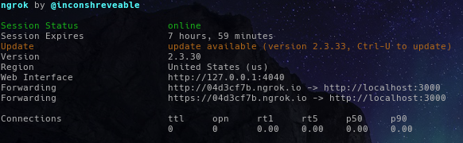

# Local Development

This guide will describe how to set up Colophon for local development.

### 1. Preliminary setup

While Colophon can be used to scan the repositories for a personal or organization account, using an organization account is more representative of our use case.

Go to Github and create an organization to use for test purposes.  It will also be necessary for this organization to have some repositories to scan, so create several of those as well.

### 2. Set up database

Colophon uses a PostgreSQL database as a backend.  If necessary, follow the proper process for your operating system to install PostgreSQL.

Once you have a running instance of PostgreSQL, set it up for Colophon.

First, run these commands as the `postgres` user:

```
$ createuser -P -h localhost -d -R -e colophon
$ createdb -O colophon colophon
```

Note that you will be prompted for a password, take note of it for future steps.

Then, from the repository root run these comands under your regular user account:

```
$ psql -U colophon -h localhost -p 5432 colophon < ./database/app.sql
$ psql -U colophon -h localhost -p 5432 colophon < ./database/sessions.sql
```

You will be prompted to enter the same password you used to create the `colophon` PostgreSQL account.

### 3. Set up ngrok

[ngrok](https://ngrok.com/) is an application that exposes servers running on your local machine to the public internet over secure tunnels, and is needed so that Github can communicate with your locally-running instance of Colophon.

[Download](https://ngrok.com/download) it, and run it on port `3000`:

`ngrok http 3000`

You'll get a screen in your terminal displaying ngrok's status:



Take note of the address being used for `https`, you'll need it for future steps.  Also note that this address will expire after 8 hours.  When you restart ngrok you'll get a new address, and will have to update the associated settings.

### 4. Set up Github app

Go to the settings page for the organization you set up in step #1.  It will be located here, depending on the name you chose: `https://github.com/organizations/[name-of-test-org]/settings`.

Fill out the following details:

> Github App name

This must be unique across github.

> Homepage URL

Set this to the ngrok `https` address from step 3.

> User authorization callback URL

Set this to `<ngrok_https_address>/auth/callback`

> Webhook URL

Set this to the ngrok `https` address from step 3.

> Webhook secret

Generate a value for this, and take note of it for future steps.

> Permissions

Set the following to `read-only`:
- repository contents
- repository metadata
- organization members

> events

Subscribe to the following events:
- create
- delete
- push
- repository

Once all of the above has been filled out, click `Create Github App`. Take note of the following values for future steps: `App ID`, `Client ID`, and `Client secret`.

You'll see an alert at the top of the page directing you to generate a private key.  Click the `generate a private key` link, and then the `Generate a private key` button at the bottom of the page.  Save the `pem` file, and take note of the saved location for future steps.

### 5. Set up environment

Create a file in the repository named `.env`.  Open it and `export` the following environment variables:

Obtained in step 4:
- `GITHUB_APP_ID`
- `GITHUB_CLIENT_ID`
- `GITHUB_CLIENT_SECRET`
- `GITHUB_APP_LINK`
- `GITHUB_PRIVATE_KEY_PATH`
- `GITHUB_WEBHOOK_SECRET`

Obtained in step 2:
- `POSTGRES_HOST`
- `POSTGRES_PORT`
- `POSTGRES_DB`
- `POSTGRES_USER`
- `POSTGRES_PASSWORD`

- `COLOPHON_LINK`  
Set this to the ngrok `https` url.
- `COLOPHON_SESSION_SECRET`  
Generate this.

### 6. Run app

First load the environment variables from the previous step:

`source .env`

Then run the application:

`npm run dev`

The application will be accessible at the ngrok `https` url, on port `3000`.
